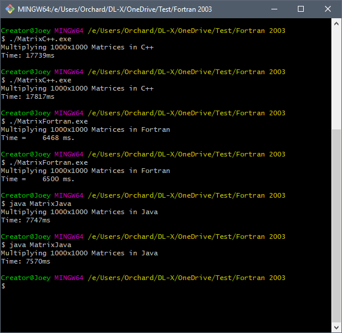

# FortranProject

This project will showcase Fortran's computational speed in a comparison test with Java and C++. 

## Matrix Multiplication Test
----
Two 1000 x 1000  matrices will be multiplied together using the same algorithm, but in three different languages. 

Here  are the resulsts: 

